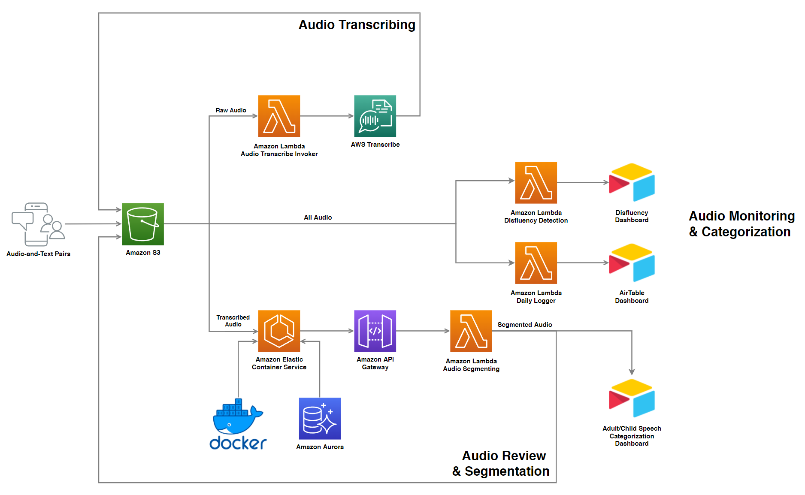

# Label Pipeline

This repository hosts the necessary AWS Lambda scripts to facilitate an automated audio labeling pipeline. The main components of the pipeline includes:

- [Audio Transcription using AWS Transcribe](https://github.com/bookbot-kids/label-pipeline/tree/main/src/transcribe)

- [Audio Splitting](https://github.com/bookbot-kids/label-pipeline/tree/main/src/audio_splitter)

- [Audio Adult/Child Classifier](https://github.com/bookbot-kids/label-pipeline/tree/main/src/audio_classifier)

- [Integration with AirTable Dashboards](https://github.com/bookbot-kids/label-pipeline/tree/main/src/airtable_apply_annotations)

- [Label Studio Webhook Integration](https://github.com/bookbot-kids/label-pipeline/tree/main/src/webhook_listener)

# Overview

The high-level overview of this pipeline is shown below.



# Structure

```
.
├── README.md
├── images
│   ├── audio-labeling-pipeline-v2.png
│   └── audio-labeling-pipeline.png
├── requirements.txt
├── src
│   ├── airtable_apply_annotations
│   │   ├── airtable_s3_integration.py
│   │   ├── audio_dashboard_table.py
│   │   ├── disfluency_table.py
│   │   ├── lambda_function.py
│   │   └── s3_utils.py
│   ├── audio_classifier
│   │   ├── lambda_function.py
│   │   └── s3_utils.py
│   ├── audio_splitter
│   │   ├── airtable_logger.py
│   │   ├── lambda_function.py
│   │   └── s3_utils.py
│   ├── config.py
│   ├── step_function_invoker
│   │   └── lambda_function.py
│   ├── transcribe
│   │   ├── homophones.py
│   │   ├── lambda_function.py
│   │   ├── mispronunciation.py
│   │   └── srt2txt.py
│   └── webhook_listener
│       └── lambda_function.py
├── tests
│   ├── audio_classifier
│   │   ├── send_post.py
│   │   └── test-event-1.json
│   ├── audio_splitter
│   │   ├── test-event-1.json
│   │   └── test-event-2.json
│   ├── step_function_invoker
│   │   └── test-event-1.json
│   └── transcribe
│       ├── mispronunciation_test.py
│       ├── test-event-1.json
│       ├── test-event-2.json
│       ├── test-event-3.json
│       └── test-event-4.json
└── util
    ├── audio-classifier
    │   └── onnx-export-quantize.py
    ├── label-studio
    │   └── audio-transcription-segment-interface.js
    ├── s3
    │   └── CORS.json
    ├── stepfunctions
    │   └── transcribe.asl
    └── transcribe
        └── special_words.txt
```
