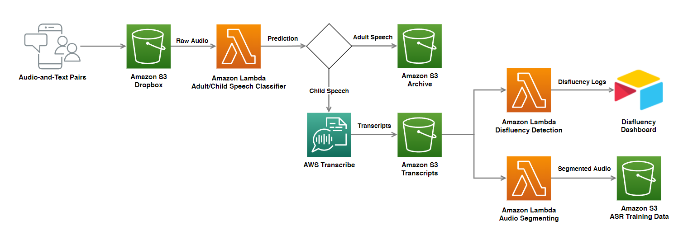

# Home

## Label Pipeline

This repository hosts the necessary AWS Lambda scripts to facilitate an automated audio labeling pipeline. The main components of the pipeline includes:

- [Audio Transcription using AWS Transcribe](https://github.com/bookbot-kids/label-pipeline/tree/main/src/transcribe)

- [Audio Splitting](https://github.com/bookbot-kids/label-pipeline/tree/main/src/audio_splitter)

- [Audio Adult/Child Classifier](https://github.com/bookbot-kids/label-pipeline/tree/main/src/audio_classifier)

- [Integration with AirTable Dashboards](https://github.com/bookbot-kids/label-pipeline/tree/main/src/airtable_apply_annotations)

- [Label Studio Webhook Integration](https://github.com/bookbot-kids/label-pipeline/tree/main/src/webhook_listener)

## Pipeline Overview

The high-level overview of this pipeline is shown below.



## Installation

```bash
git clone https://github.com/bookbot-kids/label-pipeline.git
cd label-pipeline
pip install -r requirements.txt
```

## References

```bib
@misc{label-studio-no-date,
	author = {{Label Studio}},
	title = {{Improve Audio Transcriptions with Label Studio}},
	url = {https://labelstud.io/blog/Improve-Audio-Transcriptions-with-Label-Studio.html},
}
```

## Contributors

<a href="https://github.com/bookbot-kids/label-pipeline/graphs/contributors">
  
</a>
